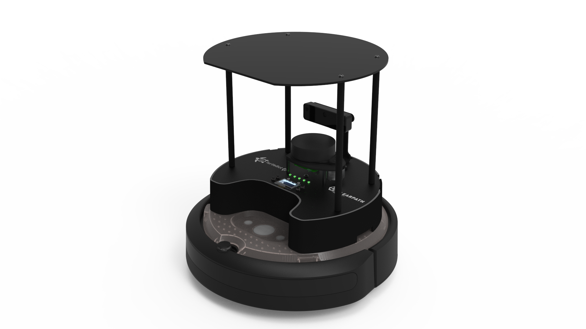

# Vicon Constellations

## Purpose

We are using the Create 3 Turtlebot 4.

We want to track a fleet of these bots with a Vicon tracker setup, which necessitates IR retro-reflector constellations. We can just tape them on, but they come with a little mounting base, so I figure I would make a resilient system. The goal, then, is to come up with a "layout" of slots that the mounting base snaps into. We can then pick 6 of the slots from the layout to map to a robot to form a "constellation."

The point of this repository is to answer a few questions:
1. What is a good "layout"? Nominally, it's one that facilitates good constellations.
2. What is a good "constellation"? Nominally, it _needs_ to be non-coplanar and not radially symmetric. It should also be different from other active constellations.
3. What does it mean for two constellations to be "different?"
4. Given a layout and a fleet size, what is the best set of constellations possible?

## Design Considerations

Since constellations need to be non-coplanar (since a coplanar constellation has two solutions), we have a bit of a predicament because the TurtleBot's top integration plate is flat. Our solution is to simply elevate some of the retro-reflectors. We could do this with a little offset jig, but that complicates things and adds a part. Instead, we have a ring in the center of the plate that is elevated above the others (e.g., 1cm up, depends on your mocap's tracking error). This reduces the number of constellations available in a layout, since we are forced to pick at least 1 (ideally >1 for tracking loss) from the elevated region, but it removes parts and setup complexity (and frankly, I don't trust my theoretical offset adapters to not be wiggly, which would make the constellations instable).

The four M4x0.7 screws for the top integration plate are arranged in a radius of 118.33mm, but if you dont want to extrude over the flat fillet at the front, there's a 115.00mm working radius. I don't want to go beyond these bounds just for design sleekness reasons. There's nothing stopping you from making a mount way larger than the top integration plate (but you'll need to modify my code to exclude candidates that intersect the screw positions, of course). All this is to say, all of the set positions in a layout will be generated within a 110mm radius.

Also, I have settled on some arbitrary defaults for the number of positions in a layout. I have decided that 3 will be elevated in the middle in a 30mm radius, and 9 more will be scattered around the outside 80mm ring.
