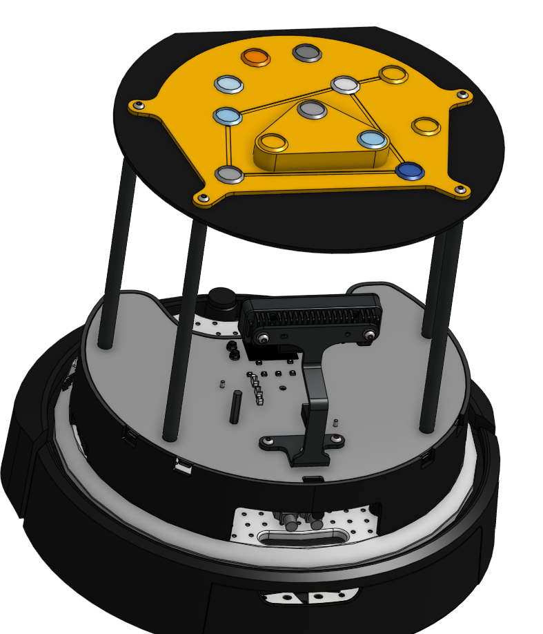

# Vicon Constellations

## Purpose

We are using the Create 3 Turtlebot 4.


We want to track a fleet of these bots with a Vicon tracker setup, which necessitates IR retro-reflector constellations. We can just tape them on, but they come with a little mounting base, so I figure I would make a resilient system. The goal, then, is to come up with a "layout" of slots that the mounting base snaps into. We can then pick a few of the slots from the layout to map to a robot to form a "constellation."

The point of this repository is to answer a few questions:
1. What is a good "layout"? Nominally, it's one that facilitates good constellations.
2. What is a good "constellation"? Nominally, it _needs_ to be non-coplanar and not radially symmetric. It should also be different from other active constellations. 4 is necessary (3 to set a plane, 1 to choose an off-plane direction), but I'll go for at least 6 (4 in plane, 2 elevated).
3. What does it mean for two constellations to be "different?" If markers are corresponding, we can rotate one to the direction that minimizes cross-covariance then do root mean squared distance (Kabsch algorithm), but our markers are indistinguishable reflective balls, so we also need to consider permutations.
4. Given a layout and a fleet size, what is the best set of constellations possible? We'll need to pick some subset from a pairwise distance matrix that maximizes dispersion (I'm pretty sure this is NP-hard from an initial google).

## Design Considerations

Since constellations need to be non-coplanar (since a coplanar constellation has two solutions), we have a bit of a predicament because the TurtleBot's top integration plate is flat. Not a really tough predicament, we simply pick some retro-reflector slots to be elevated (e.g., ~1.5cm) above the others after generation. There needs to be at least 1 elevated marker in a constellation, and should be at least two, and to optimize expressibility of a layout, you should elevate half of them, though you can choose to elevate them however you like.

The four M4x0.7 screws for the top integration plate are arranged in a radius of 118.33mm, but if you dont want to extrude over the flat fillet at the front, there's a 115.00mm working radius. I don't want to go beyond these bounds just for design sleekness reasons. There's nothing stopping you from making a mount way larger than the top integration plate (but you'll need to modify my code to exclude candidates that intersect the screw positions, of course). All this is to say, all of the set positions in a layout will be generated within a 110mm radius.

Also, I have settled on some arbitrary defaults for the number of positions in a layout: 12.

## Usage

Activate an environment that has the required packages. E.g.,

```
python3 -m venv .venv

source .venv/bin/activate # unix
.venv\Scripts\activate.bat # windows

pip install -r requirements.txt
```

Then, `python3 generate_layout.py` will try to find a good layout and display it for you. You can type "retry" to force it to try again, or you can continue by indicating which marker notch id's you want elevated (you can just press enter if non-coplanarity is not a concern). This will generate `candidate_layout.json` which you can use with the other tools.

Once you have a layout json, you can try `python3 generate_constellations.py [filename.json] [number of constellations to generate] [number of elevated markers] [number of normal markers]` (those are required args). This will employ a very unsophisticated algorithm to generate a set of constellations that are "maximally different" from each other on the given layout, generated under `candidate_constellations.json`. It'll also display that as an image so you can easily pick and place. Note that I coded it very inefficiently. If $N$ is the number of total notches in the layout, and $C$ is the number of markers in your constellation, the code is about $\mathcal{O}((N-C)^2\cdot C!)$. It's pretty bad... If you have a big batch, I seriously recommend implementing ICP or better heuristics or switching programming languages rather than shipping a slurm job, because it will take forever.

`visualization.py` is a just utils file. If you run it, you can visualize the demo json which is already saved as png's. Alter `main()` however you please to make your own matplotlib diagrams with some modifications to the code there.

## Results

All of these scripts dump into `./artifacts/`, which is where you'll find pngs and jsons.

I do have a demo included in the repo. While I was working on marker layouts, I coined the term constellation, not really even sure if it's a real term,but it makes a bit of sense, since the Vicon cameras are searching from a fixed vocabulary. One run reminded me of an actual constellation, Corvus, the crow, so I decided to tweak it a bit and give it a nice design. You can see the build artifacts in `./artifacts/`, and here's a 3d render of the final model!


